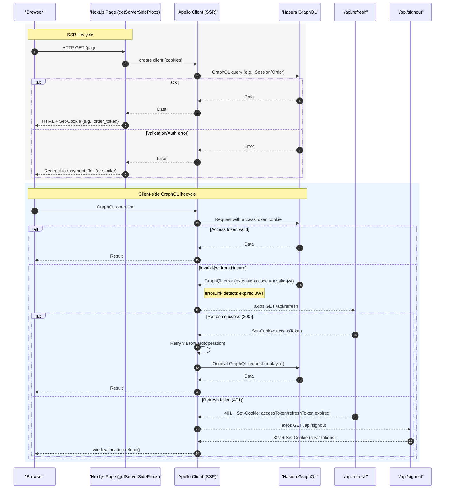

```mermaid
sequenceDiagram
    autonumber
    participant B as "Browser"
    participant N as "Next.js Page (getServerSideProps)"
    participant A as "Apollo Client (SSR)"
    participant H as "Hasura GraphQL"
    participant S as "/api/refresh"
    participant O as "/api/signout"

    rect rgb(245,245,245)
      Note over B,N: SSR lifecycle
      B->>N: HTTP GET /page
      N->>A: create client (cookies)
      A->>H: GraphQL query (e.g., Session/Order)
      alt OK
        H-->>A: Data
        A-->>N: Data
        N-->>B: HTML + Set-Cookie (e.g., order_token)
      else Validation/Auth error
        H-->>A: Error
        A-->>N: Error
        N-->>B: Redirect to /payments/fail (or similar)
      end
    end

    rect rgb(235,245,255)
      Note over B,H: Client-side GraphQL lifecycle
      B->>A: GraphQL operation
      A->>H: Request with accessToken cookie
      alt Access token valid
        H-->>A: Data
        A-->>B: Result
      else invalid-jwt from Hasura
        H-->>A: GraphQL error (extensions.code = invalid-jwt)
        Note right of A: errorLink detects expired JWT
        A-->>S: axios GET /api/refresh
        alt Refresh success (200)
          S-->>A: Set-Cookie: accessToken
          A->>A: Retry via forward(operation)
          A->>H: Original GraphQL request (replayed)
          H-->>A: Data
          A-->>B: Result
        else Refresh failed (401)
          S-->>A: 401 + Set-Cookie: accessToken/refreshToken expired
          A-->>O: axios GET /api/signout
          O-->>A: 302 + Set-Cookie (clear tokens)
          A-->>B: window.location.reload()
        end
      end
    end
```